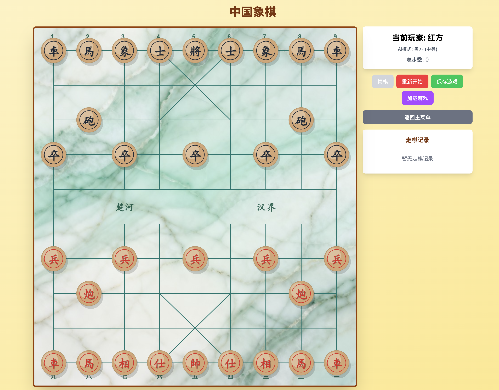

# Chinese Chess

一个基于 React + TypeScript 开发的在线中国象棋游戏，支持人机对战和双人对战模式。

## 项目简介

这是一个功能完整的中国象棋 Web 应用，使用现代前端技术栈构建。项目实现了完整的象棋规则引擎、AI 对手、主题系统、音效反馈等功能，提供了流畅的游戏体验。



## 主要功能

### 🎮 游戏模式
- **双人对战**: 支持本地双人对弈
- **人机对战**: 三种难度级别的 AI 对手（简单、中等、困难）
- **游戏保存/加载**: 支持游戏进度保存到本地存储

### 🎨 主题系统
- **棋子主题**: 新拟态、经典、木质、石头等多种风格
- **棋盘主题**: 纸张、石头、大理石等背景样式
- **自定义棋子大小**: 可调整棋子显示尺寸

### 🎯 游戏功能
- **完整的规则引擎**: 实现所有中国象棋规则（将帅对脸、蹩马腿、塞象眼、炮的翻山等）
- **智能提示**: 高亮显示选中棋子和合法移动位置
- **走棋历史**: 支持中文记谱法显示走棋记录
- **悔棋功能**: 支持撤销上一步操作
- **音效反馈**: 移动、吃子、将军等操作配有音效和语音提示
- **动效展示**: 将军和将死时的视觉动效

### 🤖 AI 对手
- **简单模式**: 随机选择合法移动
- **中等模式**: 贪心算法，选择最优评估移动
- **困难模式**: Minimax 算法 + Alpha-Beta 剪枝，搜索深度 3 层

## 技术栈

- **前端框架**: React 19.2.0
- **类型系统**: TypeScript 5.9.3
- **图形渲染**: Konva 10.0.12 + react-konva 19.2.1
- **样式方案**: Tailwind CSS 4.1.17
- **构建工具**: Vite 7.2.4
- **包管理**: Yarn

## 快速开始

### 安装依赖

```bash
nvm use 20
yarn install
```

### 开发模式

```bash
yarn dev
```

启动后访问 `http://localhost:5173`

### 构建生产版本

```bash
yarn build
```

### 预览生产构建

```bash
yarn preview
```

## 项目结构

```
src/
├── components/          # UI 组件层
│   ├── AIConfig.tsx    # AI 配置界面
│   ├── Board.tsx       # 棋盘组件
│   ├── EffectOverlay.tsx # 动效覆盖层
│   ├── GameControls.tsx  # 游戏控制按钮
│   ├── GameInfo.tsx    # 游戏信息显示
│   ├── GameModeSelector.tsx # 游戏模式选择器
│   ├── MoveHistory.tsx # 走棋历史记录
│   ├── Piece.tsx       # 棋子组件
│   └── SettingsMenu.tsx # 设置菜单
├── hooks/              # React Hooks
│   └── useChessGame.ts # 游戏状态管理核心 Hook
├── types/              # TypeScript 类型定义
│   ├── chess.ts        # 游戏核心类型
│   ├── pieceTheme.ts   # 棋子主题类型
│   └── boardTheme.ts   # 棋盘主题类型
├── utils/              # 工具函数层
│   ├── ai.ts           # AI 算法实现
│   ├── rules.ts        # 象棋规则引擎
│   ├── coordinates.ts  # 坐标转换工具
│   ├── notation.ts    # 中文记谱法
│   ├── sounds.ts       # 音效和语音
│   ├── pieceThemes.tsx # 棋子主题实现
│   └── boardThemes.ts  # 棋盘主题实现
├── assets/             # 静态资源
├── App.tsx             # 应用主组件
├── main.tsx            # 应用入口
└── index.css           # 全局样式
```

## 功能说明

### 操作方式
- **点击选择**: 点击棋子选中，再点击目标位置移动
- **拖拽移动**: 直接拖拽棋子到目标位置
- **合法移动提示**: 选中棋子后，绿色圆点显示所有合法移动位置

### 游戏规则
- 完整实现中国象棋所有规则
- 自动检测将军和将死状态
- 防止非法移动（如移动后导致被将军）

### 设置选项
- 点击右上角设置按钮可调整：
  - 棋子主题样式
  - 棋盘背景主题
  - 棋子大小

## 开发说明

详细的架构设计文档请参考 [arch.md](./arch.md)

## License

MIT
